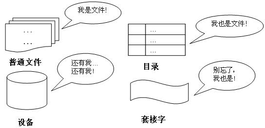
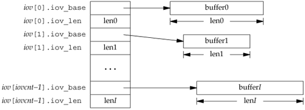

## 文件抽象

fs模块是文件操作的封装，它提供了文件的读取、写入、更名、删除、遍历目录、链接POSIX文件系统操作。与其他模块不同的是，fs模块中的所有操作都提供了异步和同步两个版本，例如读取文件内容函数的异步方法：readFile(),同步方法readFileSync()。


### 一切皆文件
“一切皆是文件”是 Unix/Linux 的基本哲学之一。不仅普通的文件，目录、字符设备、块设备、 套接字等在 Unix/Linux 中都是以文件被对待；它们虽然类型不同，但是对其提供的却是同一套操作接口。



文件是一种抽象机制，它对磁盘进行了抽象。

文件就是字节序列，每个I/O设备，包括磁盘、键盘、显示器、甚至网络，都可以抽象成文件，在Unix/Linux系统中，系统中所有的输入输出都是通过调用IO系统调用来完成。

文件是对IO的抽象，就像虚拟存储器是对程序存储的抽象，进程是对一个正在运行程序的抽象。这些都是操作系统重要的抽象。

抽象机制最重要的特性是对管理对象的命名，所以文件有文件名，且文件名要符合一定的规范。


### 文件主要操作
- open
- read
- write
- close

上面的操作比较简单，就不是细说，后面会写文章再介绍读文件、写文件、刷新数据这几个重要的操作。如果有兴趣，可以通过man 2 read 命令来查看帮助文档。


### 文件类型
可以通过ls -l查看文件类型，主要有下面几种常见的。
- 普通文件
  - 包括文本文件和二进制文件
- 目录 
  - 和普通文件相比，目录也存储在介质上，但是目录不存储常规文件，它只是用来组织、管理文件。
- proc文件
  - proc不存储，所以不占用任何空间，proc使得内核可以生成与系统状态和配置相关的信息，该信息可以由用户和系统内核从普通文件读取，无需专门的工具。
其它更多的文件类型，可以通过man ls 查看。


### 文件属性
文件属性包括文件权限信息、创建时间、最后修改时间、最后读取时间、文件大小、文件引用数等信息，这些文件属性也称为文件元数据。


### 文件系统之高级读写
#### 文件映射 mmap

`man 2 mmap` 查看：

```c++

#include <sys/mman.h>

void *mmap(void *addr, size_t len, int prot, int flags, int fd, off_t offset);

```
通过mmap系统调用，把一个文件映射到进程虚拟地址空间上。也就是说磁盘上的文件，现在在系统看来是一个内存数组了，这样应用程序访问文件就不需要系统IO调用，而是直接读取内存。

#### 优点： 
* 1、从内存映像文件中读写，避免了read、write多余的拷贝。 
* 2、从内存映像文件中读写，避免了多余的系统调用和用户-内核模式的切换 
* 3、可以多个进程共享内存映像文件。

#### 缺点： 
* 1、内存映像需要整数倍页大小，如果文件较小，会浪费内存。 
* 2、内存映像需要进程地址空间，大的内存映像可能导致地址空间碎片，找不到足够大的空余连续区域供其它用。 


#### 离散 I/O 
readv和writev函数让我们在单个函数调用里从多个不连续的缓冲里读入或写出。这些操作被称为分散读（scatter read）和集合写（gather write）。

```c++

#include <sys/uio.h>

ssize_t readv(int filedes, const struct iovec *iov, int iovcnt);

ssize_t writev(int filedes, const struct iovec *iov, int iovcnt);

两者都返回读或写的字节数，错误返回-1。
```
这两个函数的第二个参数是指向iovec结构数组的一个指针：
```c++
struct iovec {
  void   *iov_base;      /* starting address of buffer */
  size_t iov_len;        /* size of buffer */
};
```
iov数组中的元素数由iovcnt说明。其最大值受限于IOV_MAX。


writev以顺序iov[0]，iov[1]至iov[iovcnt-1]从缓冲区中聚集输出数据。writev返回输出的字节总数，通常，它应等于所有缓冲区长度之和。

readv则将读入的数据按上述同样顺序散布到缓冲区中。readv总是先填满一个缓冲区，然后再填写下一个。readv返回读到的总字节数。如果遇到文件结尾，已无数据可读，则返回0。


### 总结
* 零拷贝技术可以减少数据拷贝和共享总线操作的次数，消除传输数据在存储器之间不必要的中间拷贝次数，从而有效地提高数据传输效率。而且，零拷贝技术减少了用户应用程序地址空间和操作系统内核地址空间之间因为上下文切换而带来的开销。

是用户程序尝试优化的重要可选的优化手段。

* 向量 I/O 操作可以取代多个线性 I/O 操作, 性能更好

 - 除了减少了发起的系统调用次数，通过内部优化，向量 I/O 可以比线性 I/O 提供更好的性能。
 - 支持原子性, 一个进程可以执行单个向量 I/O 操作，避免了和其他进程交叉操作的风险。

### 参考
http://www.ibm.com/developerworks/cn/linux/l-cn-zerocopy1/
