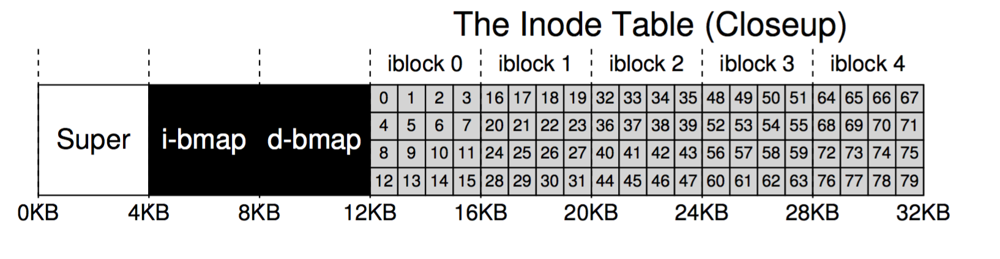
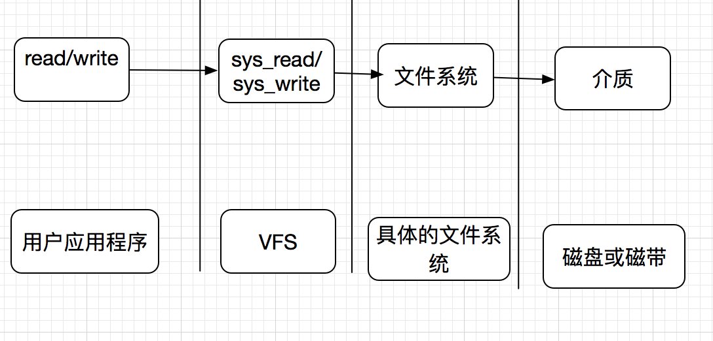

## 文件系统实现原理

文件系统存储在磁盘上，一般磁盘会被划分为多个分区，每个分区可以是一个独立的文件系统。

磁盘的0号扇区为主引导记录(Master Boot Record，MBR)，用来引导计算机。

在MBR的结尾是分区表，该分区表标识了每个分区的起始和结束地址。表中的一个分区被标识为活动分区，在计算机被引导时，BIOS读入并执行MBR。MBR首先做的是确定活动分区，读入它的第一个块，称为引导块，并执行。

### 一种常见的文件系统（分区）结构图

- Super块
  - 在系统启动时，会读取Super块，它包含了文件系统的所要重要参数, 通常会做多个备份。
- i-bmap 块
  - 用来管理inode，标识inode是否空闲或被使用了。
- d-bmap块
  - 用来管理磁盘块，标识磁盘块是空闲还是被使用了。

### 文件系统实现
文件系统一个重要的功能是记录文件使用了哪些磁盘块以及磁盘块的管理，标识磁盘块是被使用，还是空闲。实现思路有下面几种。

* 连续分配
  * 把每个文件存储在相邻的磁盘块上。如磁盘块大小2KB,200KB的文件，需要 100个磁盘块，如果磁盘块大小为4KB,刚需要50个磁盘块。

    由于每个文件都是从一个新的磁盘块开始的，这样如果一个文件只占了磁盘块大小的一半，那么另一半就被浪费了，没法被别的文件使用，不过连续分配的实现，实现比较简单，只需要记录文件的第一个磁盘块位置和块数，另外读取快速，因为只需要一次寻道，之后不需要导道和旋转延迟。

    随着时间推移，磁盘碎片比较严重。因为反复写文件，删除文后，容易在磁盘块上形成空洞。

* 链表分配
  * 为每个文件构造磁盘块链表，每个块在前面指向文件的下一个磁盘块。

    因为是一个链表，所以顺序读取很快，但随机读取很慢，且每个块中，指向下一个磁盘块的指针是要占用空间的，这样导致每个磁盘块能够存储的数据不再是2的整数次幂。

    但程序读写文件一般是以2的整数次幂来读写磁盘，这样造成额外的开销，因为读一个块的数据，要读取二个磁盘块。

* inode 节点方案
  * 使用一个特殊的东西来记录每个文件的所使用的磁盘块， 这特殊的东西称为i节点数据结构，其存储了文件 一些属性及文件所使用的到的磁盘块。

   i节点只有在对应的文件被打开时，才会存在内存中，这样即使文件系统文件非常多，只要打开的文件不多，就不会占用太多的内存。

   文件的元数据和文件数据是分开存储，也就是一个文件有i节点和数据文件这两个属性。

   每个存储i节点的磁盘块空间是有限，且一个文件只有一个i节点，那么当一个文件比较大时，怎么解决？大家想没有想起C语言中的指针及指针的指针。

   一种解决办法是预留部分数据块，用来存储指向磁盘块的指针，而不是直接直接指向磁盘块。

### Linux文件系统的实现
Unix/Linux文件系统的实现是采用i节点的方案，文件系统ext2、ext3都是如此，ext4相比前面二种文件 ，做了不少优化，本书便不在此展开。

### 文件系统与操作系统的协作

文件系统是操作系统的一部分，操作系统是相对稳定，但文件系统却是有好多，如ext2、ext3 、ext4 、ZFS 等，那么操作系统是如何兼容这些不同的文件系统，以对外提供统一服务。

C++、JAVA程序员很容易想到利用多态来实现，对，操作系统也是采用类似的思路。对不同的文件系统，抽象出所有文件系统都支持的、基本的、概念上的数据结构和接口 ，如前文描述的关于文件和目录的基本操作。

这些统一抽象组件，叫做虚拟文件系统(Virtual File System ,VFS),VFS作为系统内核组件，为用户空间程序提供了文件和文件系统相关的接口。

VFS使用得用户可以直接调用write、read 这样的文件系统调用，而不用考虑底层是什么文件系统。

横向地看下它们的关系，如下图所示

### 总结

文件系统是对磁盘设备的抽象，屏蔽了具体的存储类型，比如磁盘，内存。

