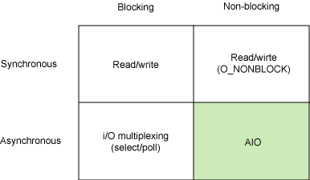
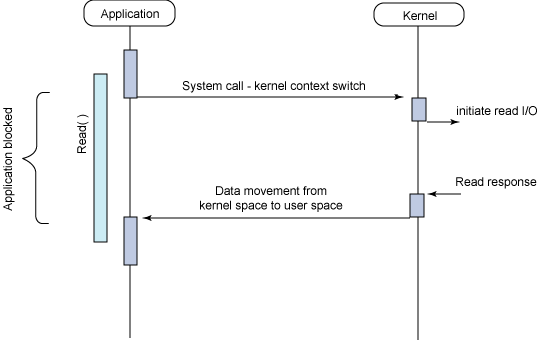
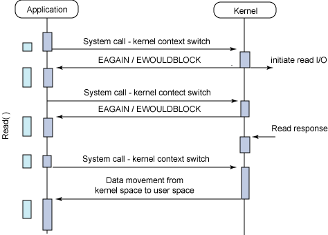
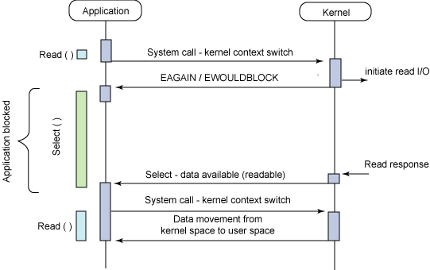
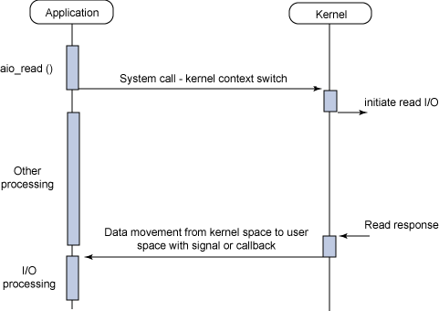

## IO 那些事儿
Linux 异步 I/O 是 Linux 内核中提供的一个相当新的增强。它是 2.6 版本内核的一个标准特性，AIO 背后的基本思想是允许进程发起很多 I/O 操作，而不用阻塞或等待任何操作完成。稍后或在接收到 I/O 操作完成的通知时，进程就可以检索 I/O 操作的结果。

### I/O 模型
在深入介绍 AIO API 之前，让我们先来探索一下 Linux 上可以使用的不同 I/O 模型。这并不是一个详尽的介绍，但是我们将试图介绍最常用的一些模型来解释它们与异步 I/O 之间的区别。图 1 给出了同步和异步模型，以及阻塞和非阻塞的模型。

每个 I/O 模型都有自己的使用模式，它们对于特定的应用程序都有自己的优点。本节将简要对其一一进行介绍。

### 同步阻塞 I/O

最常用的一个模型是同步阻塞 I/O 模型。在这个模型中，用户空间的应用程序执行一个系统调用，这会导致应用程序阻塞。这意味着应用程序会一直阻塞，直到系统调用完成为止（数据传输完成或发生错误）。调用应用程序处于一种不再消费 CPU 而只是简单等待响应的状态，因此从处理的角度来看，这是非常有效的。
图 2 给出了传统的阻塞 I/O 模型，这也是目前应用程序中最为常用的一种模型。在调用 read 系统调用时，应用程序会阻塞并对内核进行上下文切换。然后会触发读操作，当响应返回时（从我们正在从中读取的设备中返回），数据就被拷贝到用户空间的缓冲区中。然后应用程序就会解除阻塞（read 调用返回）。

从应用程序的角度来说，read 调用会延续很长时间。实际上，在内核执行读操作和其他工作时，应用程序的确会被阻塞。

### 同步非阻塞 I/O

同步阻塞 I/O 的一种效率稍低的变种是同步非阻塞 I/O。在这种模型中，设备是以非阻塞的形式打开的。这意味着 I/O 操作不会立即完成，read 操作可能会返回一个错误代码，说明这个命令不能立即满足（EAGAIN 或 EWOULDBLOCK），如图 3 所示。

非阻塞的实现是 I/O 命令可能并不会立即满足，需要应用程序调用许多次来等待操作完成。这可能效率不高，因为在很多情况下，当内核执行这个命令时，应用程序必须要进行忙碌等待，直到数据可用为止，或者试图执行其他工作。正如图 3 所示的一样，这个方法可以引入 I/O 操作的延时，因为数据在内核中变为可用到用户调用 read 返回数据之间存在一定的间隔，这会导致整体数据吞吐量的降低。

### 异步阻塞 I/O
另外一个阻塞解决方案是带有阻塞通知的非阻塞 I/O。在这种模型中，配置的是非阻塞 I/O，然后使用阻塞 select 系统调用来确定一个 I/O 描述符何时有操作。使 select 调用非常有趣的是它可以用来为多个描述符提供通知，而不仅仅为一个描述符提供通知。对于每个提示符来说，我们可以请求这个描述符可以写数据、有读数据可用以及是否发生错误的通知。

select 函数所提供的功能（异步阻塞 I/O）与 AIO 类似。不过，它是对通知事件进行阻塞，而不是对 I/O 调用进行阻塞。

### 异步非阻塞 I/O

异步非阻塞 I/O 模型是一种处理与 I/O 重叠进行的模型。读请求会立即返回，说明 read 请求已经成功发起了。在后台完成读操作时，应用程序然后会执行其他处理操作。当 read 的响应到达时，就会产生一个信号或执行一个基于线程的回调函数来完成这次 I/O 处理过程。

在一个进程中为了执行多个 I/O 请求而对计算操作和 I/O 处理进行重叠处理的能力利用了处理速度与 I/O 速度之间的差异。当一个或多个 I/O 请求挂起时，CPU 可以执行其他任务；或者更为常见的是，在发起其他 I/O 的同时对已经完成的 I/O 进行操作。

### 总结
慢速的 IO 设备和高速的 CPU 如何协作是门学问。
但这里并不是说同步阻塞IO 一定不好，还是要根据场景灵活选择。

依照作者的经验， 同步 IO 适用于时间可控，少量调用的场景。
异步 IO 适用于时间不可控（如网络异常），大量调用的场景。

### 参考

- https://www.ibm.com/developerworks/cn/linux/l-async/
