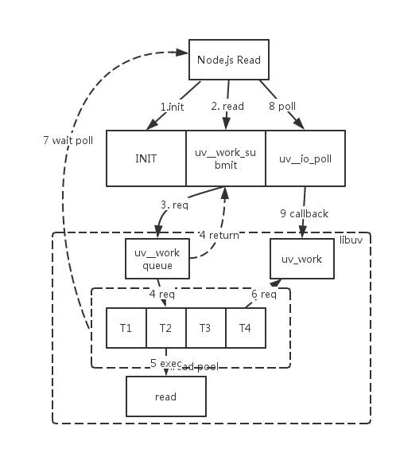

## libuv 选型

### linux native aio

Linux native aio 有两种API，一种是libaio提供的API，一种是利用系统调用封装成的API,后者使用的较多，因为不需要额外的库且简单。

- io_setup : 是用来设置一个异步请求的上下文，第一个参数是请求事件的个数，第二个参数唯一标识一个异步请求。
- io_commit: 是用来提交一个异步io请求的，在提交之前，需要设置一下结构体`iocb`。
- io_getevents: 用来获取完成的io事件，参数`min_nr`是事件个数的的最小值，`nr`是事件个数的最大值，如果没有足够的事件发生，该函数会阻塞。
- io_destroy：在所有时间处理完之后，调用此函数销毁异步io请求。

#### 限制
aio只能使用于常规的文件IO，不能使用于socket，管道等IO，但对于 libuv 的 fs 模块使用需求已经足够了。

io_getevents在调用之后会阻塞直到有足够的事件发生，因此要实现真正的异步IO，需要借助eventfd和epoll达到目的。

#### libuv native aio 实现
笔者实现过一个基于 libuv 的 native aio，https://github.com/yjhjstz/libuv/commit/2748728635c4f74d6f27524fd36e680a88e4f04a

从理论上看，在libuv中实现AIO, 
* 其一：比原来的libuv实现少了一次write系统调用，无需在用户态实现线程池和工作队列．
* 其二：native aio实现可以实现批量回调。

我们看下性能对比数据, 测试脚本是简单的文件读取：
* Threadpool 模型
```shell
jiangling@young:~/workspace/libuv$ wrk -t4 -c100 -d30s http://127.0.0.1:30003/
Running 30s test @ http://127.0.0.1:30003/
4 threads and 100 connections
Thread Stats Avg Stdev Max +/- Stdev
Latency 16.77ms 1.14ms 31.68ms 86.68%
Req/Sec 1.51k 162.66 2.08k 81.34%
178925 requests in 30.00s, 104.26MB read
Requests/sec: 5963.45
Transfer/sec: 3.47MB
```

* Native AIO 模型
```shell
jiangling@young:~/workspace/libuv$ wrk -t4 -c100 -d30s http://127.0.0.1:30003/
Running 30s test @ http://127.0.0.1:30003/
4 threads and 100 connections
Thread Stats Avg Stdev Max +/- Stdev
Latency 16.22ms 0.95ms 26.39ms 88.12%
Req/Sec 1.57k 191.14 2.08k 68.50%
185084 requests in 30.00s, 107.85MB read
Requests/sec: 6169.28
Transfer/sec: 3.59MB
```

** Max Latency减小16%，tps提升3%。**


### Threadpool 模型
我们先看下一次 node.js read 的调用示意图：


代码的运行经历了以下步骤： 
- 1 node, libuv 初始化；

- 2 node_file.cc中的Read方法调用libuv（fs.c）的 `uv_fs_read` ， 封装请求； 

- 3 libuv 将请求封装成 uv_work, 提交到任务队列尾部，触发信号；

- 4 此时主线程的read调用返回。 

- 5 线程池从uv_work队列中取出一个请求，开始执行read IO；

- 6 向主线程发送信号表明任务完成，等待执行read调用后的其它操作。 

- 7 主线程 epoll，从响应队列取已经完成的请求;

- 8 主线程响应 epoll事件；

- 9 主线程执行请求的callback函数。 


node.js 异步 IO 的脉络已经清晰，我们清楚的看到这样的一个 Threadpool 模型是全平台适用的。

> Linux 上的 AIO
> AIO 在 2.5 版本的内核中首次出现，现在已经是 2.6 版本的产品内核的一个标准特性了。

并且由于 Native AIO 是在 linux 2.6之后引入，并且并不稳定。 社区也有过激烈的讨论：

- https://github.com/libuv/libuv/issues/28
- https://github.com/libuv/libuv/issues/461


权衡再三，笔者也非常支持社区采用的模型，赋予用户更多的选择性和可靠性。

### 总结
用户态的线程池实现给了用户更大的灵活性和选择性。比如：

* 1.线程池的个数，默认是4个，用户可以通过设置环境变量 `UV_THREADPOOL_SIZE`指定。
* 2.和耗时的 GETADDRINFO 复用线程池。

需要指出的是，线程池模型还有改进的空间：
* `static uv_mutex_t mutex;`全局锁的优化；
* 支持任务优先级。

### 参考
