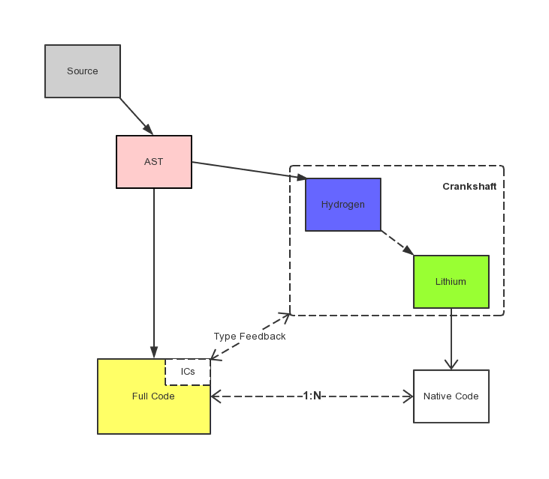
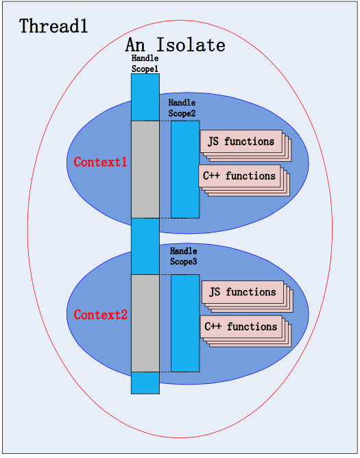
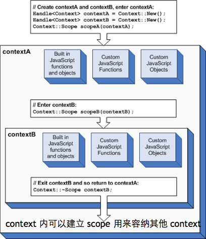

## V8 concept
### 架构图


现在 JS 引擎的执行过程大致是：源代码 --->抽象语法树 --->字节码 --->JIT--->本地代码。

V8 更加直接的将抽象语法树通过 JIT 技术转换成本地代码，放弃了在字节码阶段可以进行的一些性能优化，但保证了执行速度。
在 V8 生成本地代码后，也会通过 Profiler 采集一些信息，来优化本地代码。虽然，少了生成字节码这一阶段的性能优化，
但极大减少了转换时间。

> PS： Tuborfan 将逐步取代 Crankshaft

在使用 v8 引擎之前，先来了解一下几个基本概念：句柄（handle），作用域（scope），上下文环境（可以简单地理解为运行环境）。

### Isolate
> An isolate is a VM instance with its own heap. It represents an isolated instance of the V8 engine.
> V8 isolates have completely separate states. Objects from one isolate must not be used in other isolates.

一个 Isolate 是一个独立的虚拟机。对应一个或多个线程。但同一时刻 只能被一个线程进入。所有的 Isolate 彼此之间是完全隔离的, 它们不能够有任何共享的资源。如果不显示创建 Isolate, 会自动创建一个默认的 Isolate。

后面提到的 Context、Scope、Handle 的概念都是一个 Isolate 内部的, 如下图：


### Handle 概念
在 V8 中，内存分配都是在 V8 的 Heap 中进行分配的，JavaScript 的值和对象也都存放在 V8 的 Heap 中。这个 Heap 由 V8 独立的去维护，失去引
用的对象将会被 V8 的 GC 掉并可以重新分配给其他对象。而 Handle 即是对 Heap 中对象的引用。V8 为了对内存分配进行管理，GC 需要对 V8 中的
所有对象进行跟踪，而对象都是用 Handle 方式引用的，所以 GC 需要对 Handle 进行管理，这样 GC 就能知道 Heap 中一个对象的引用情况，当一个对象的 Handle 引用发生改变的时候，GC 即可对该对象进行回收或者移动。因此，V8 编程中必须使用 Handle 去引用一个对象，而不是直接通过 C
++ 的方式去获取对象的引用，直接通过 C++ 的方式去引用一个对象，会使得该对象无法被 V8 管理。

Handle 分为 Local 和 Persistent 两种。

从字面上就能知道，Local 是局部的，它同时被 HandleScope 进行管理。
persistent，类似与全局的，不受 HandleScope 的管理，其作用域可以延伸到不同的函数，而 Local 是局部的，作用域比较小。
Persistent Handle 对象需要 Persistent::New, Persistent::Dispose 配对使用，类似于 C++ 中 new 和 delete。

Persistent::MakeWeak 可以用来弱化一个 Persistent Handle，如果一个对象的唯一引用 Handle 是一个 Persistent，则可以使用 MakeWeak 方法来弱化该引用，该方法可以触发 GC 对被引用对象的回收。

### Scope
从概念上理解，作用域可以看成是一个句柄的容器，在一个作用域里面可以有很多很多个句柄（也就是说，一个 scope 里面可以包含很多很多个
v8 引擎相关的对象），句柄指向的对象是可以一个一个单独地释放的，但是很多时候（真正开始写业务代码的时候），一个一个地释放句柄过于
繁琐，取而代之的是，可以释放一个 scope，那么包含在这个 scope 中的所有 handle 就都会被统一释放掉了。

Scope 在 v8.h 中有这么几个：HandleScope，Context::Scope。

HandleScope 是用来管理 Handle 的，而 Context::Scope 仅仅用来管理 Context 对象。

代码像下面这样：
```c++
  // 在此函数中的 Handle 都会被 handleScope 管理
  HandleScope handleScope;
  // 创建一个 js 执行环境 Context
  Handle<Context> context = Context::New();
  Context::Scope contextScope(context);
  // 其它代码
```
一般情况下，函数的开始部分都放一个 HandleScope，这样此函数中的 Handle 就不需要再理会释放资源了。
而 Context::Scope 仅仅做了：在构造中调用 context->Enter()，而在析构函数中调用 context->Leave()。


### Context 概念 
从概念上讲，这个上下文环境也可以理解为运行环境。在执行 javascript 脚本的时候，总要有一些环境变量或者全局函数。
我们如果要在自己的 c++ 代码中嵌入 v8 引擎，自然希望提供一些 c++ 编写的函数或者模块，让其他用户从脚本中直接调用，这样才会体现出 javascript 的强大。
我们可以用 c++ 编写全局函数或者类，让其他人通过 javascript 进行调用，这样，就无形中扩展了 javascript 的功能。 

Context 可以嵌套，即当前函数有一个 Context，调用其它函数时如果又有一个 Context，则在被调用的函数中 javascript 是以最近的
Context 为准的，当退出这个函数时，又恢复到了原来的 Context。

我们可以往不同的 Context 里 “导入” 不同的全局变量及函数，互不影响。据说设计 Context 的最初目的是为了让浏览器在解析 HTML 的 iframe
时，让每个 iframe 都有独立的 javascript 执行环境，即一个 iframe 对应一个 Context。

#### 同作用域下不同的执行上下文



### 关系


从这张图可以比较清楚的看到 Handle，HandleScope，以及被 Handle 引用的对象之间的关系。从图中可以看到，V8 的对象都是存在 V8 的 Heap 中，而 Handle 则是对该对象的引用。

### 垃圾回收
垃圾回收器是一把十足的双刃剑。好处是简化程序的内存管理，内存管理无需程序员来操作，由此也减少了长时间运转的程序的内存泄漏。然而无法预期的停顿，影响了交互体验。


#### 基本概念
垃圾回收器解决基本问题就是，识别需要回收的内存。一旦辨别完毕，这些内存区域即可在未来的分配中重用，或者是返还给操作系统。一个对象当它不是处于活跃状态的时候它就死了。一个对象处于活跃状态，当且仅当它被一个根对象或另一个活跃对象指向。根对象被定义为处于活跃状态，是浏览器或 V8 所引用的对象。比如说全局对象属于根对象，因为它们始终可被访问；浏览器对象，如 DOM 元素，也属于根对象，尽管在某些场合下它们只是弱引用。


#### 堆的构成
在深入研究垃圾回收器的内部工作原理之前，首先来看看堆是如何组织的。V8 将堆分为了几个不同的区域：


**新生区**：大多数对象开始时被分配在这里。新生区是一个很小的区域，垃圾回收在这个区域非常频繁，与其他区域相独立。

**老生指针区**：包含大多数可能存在指向其他对象的指针的对象。大多数在新生区存活一段时间之后的对象都会被挪到这里。

**老生数据区**：这里存放只包含原始数据的对象（这些对象没有指向其他对象的指针）。字符串、封箱的数字以及未封箱的双精度数字数组，在新生区经历一次 Scavenge 后会被移动到这里。

**大对象区**：这里存放体积超过 1MB 大小的对象。每个对象有自己 mmap 产生的内存。垃圾回收器从不移动大对象。

**Code 区**：代码对象，也就是包含 JIT 之后指令的对象，会被分配到这里。

**Cell 区、属性 Cell 区、Map 区**：这些区域存放 Cell、属性 Cell 和 Map，每个区域因为都是存放相同大小的元素，因此内存结构很简单。

> 如上图：在 node-v4.x 之后，区域进行了合并为：新生区，老生区，大对象区，Map 区，Code 区

有了这些背景知识，我们可以来深入垃圾回收器了。

#### 识别指针
垃圾回收器面临的第一个问题是，如何才能在堆中区分指针和数据，因为指针指向着活跃的对象。大多数垃圾回收算法会将对象在内存中挪动（以便减少内存碎片，使内存紧凑），因此即使不区分指针和数据，我们也常常需要对指针进行改写。
V8 采用了标记指针法：这种方法需要在每个指针的末位预留一位来标记这个字代表的是指针或数据。


#### 对象的晋升
当一个对象经过多次新生代的清理依旧幸存，这说明它的生存周期较长，也就会被移动到老生代，这称为对象的晋升。具体移动的标准有两种：
- 对象从 From 空间复制到 To 空间时，会检查它的内存地址来判断这个对象是否已经活过一次新生代的清理，如果是，则复制到老生代中，否则复制到 To 空间中
- 对象从 From 空间复制到 To 空间时，如果 To 空间已经被使用了超过 25%，那么这个对象直接被复制到老生代。


#### 写屏障
如果新生区中某个对象，只有一个指向它的指针，而这个指针恰好是在老生区的对象当中，我们如何才能知道新生区中那个对象是活跃的呢？ 为了解决这个问题，实际上在写缓冲区中有一个列表 `store-buffer{.cc,.h,-inl.h}`，列表中记录了所有老生区对象指向新生区的情况。新对象诞生的时候，并不会有指向它的指针，而当有老生区中的对象出现指向新生区对象的指针时，我们便记录下来这样的跨区指向。由于这种记录行为总是发生在写操作时，它被称为写屏障.

#### 垃圾回收三部曲
`Stop-the-World` 的 GC 包括三个主要步骤:
1. 枚举根节点引用;
2. 发现并标记活对象;
3. 垃圾内存清理

分代回收在 V8 中分为 `Scavenge`, `Mark-Sweep`。
* `Scavenge`: 当分配指针达到了新生区的末尾，就会有一次清理。
* `Mark-Sweep`: 对于活跃超过 2 个小周期的对象，则需将其移动至老生区, 当老生区有足够多的对象时才会触发。

### 总结

如果你还想了解更多垃圾回收上的东西，我建议你读读 Richard Jones 和 Rafael Lins 写的《Garbage Collection》，这是一个绝好的参考，涵盖了大量你需要了解的内容。你可能还对《Garbage First Garbage-Collection》感兴趣，这是一篇描述 JVM 所使用的垃圾回收算法的论文。


### 参考
* https://developers.google.com/v8/get_started
* https://developers.google.com/v8/embed
* http://newhtml.net/v8-garbage-collection/
